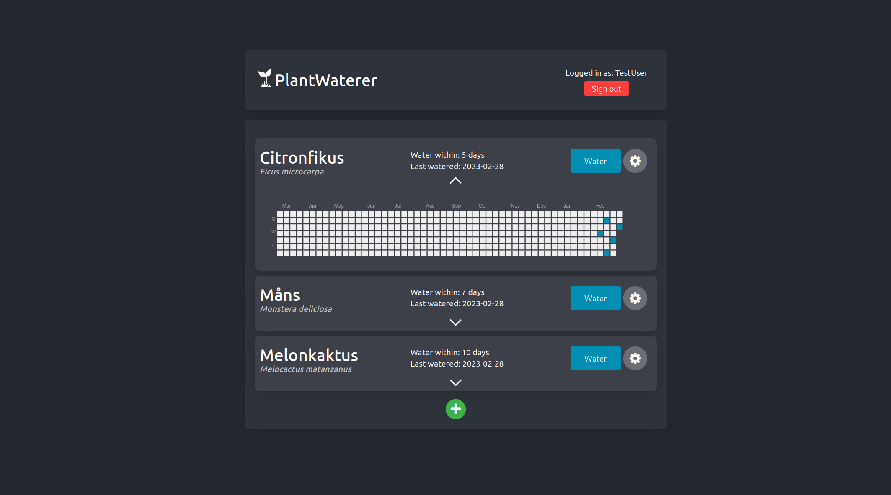
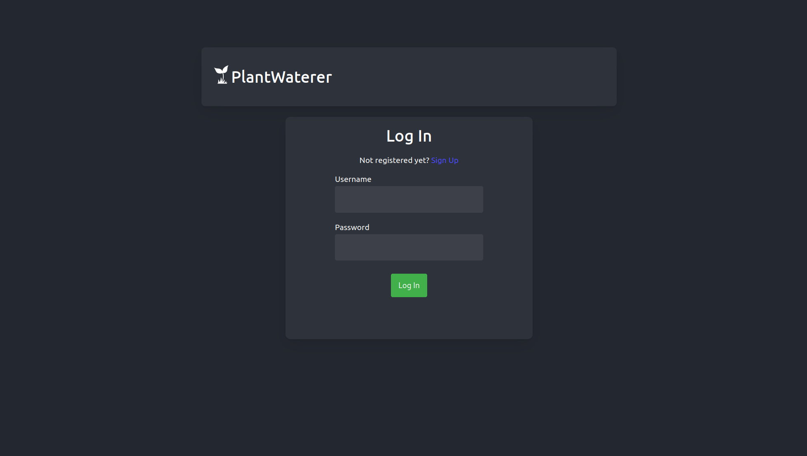

# Plant Waterer

Plant Waterer is a full stack management tool used to keep track of when you need to water your plants.

This project was done as a uni assignment in the course "Introduction to Database management".




## Installation

Copy the .env.example file in backend to .env

```bash
cp backend/.env.example backend/.env
```

Configure the .env file to your liking

Build the docker images by running

```bash
./build.sh
```

Then start the containers by running

```bash
docker compose up -d
```

## Stack

* Database - PostgreSQL
* Backend  - Go
* Frontend - React

## Database ER Diagram

 

## API Endpoints

### /registerUser

Used to register a new user.

**Methods** 

POST

**Parameters**

**Body**
```
user_name: "username"
password: "password"
confirm_password: "password"
```

**Status Codes**

200 - OK

400 - Bad request - If the body is wrongly formatted.

**Response**
```
"UUID"
```

User ID of the newly created user.

### /login

Used to login a user.

**Methods** 

POST

**Parameters**

**Body**
```
user_name: "username"
password: "password"
```

**Status Codes**

200 - OK

400 - Bad request - If the body is wrongly formatted.

401 - Unauthorized - If the username and/or password are invalid.

**Response**
```
token: "JWT_TOKEN"
```

JWT token used for authorization.

### /auth/plants

Used to get the plants of a user.

**Methods** 

GET

**Parameters**

**Header**
```
Authorization: "JWT_TOKEN"
```

**Status Codes**

200 - OK

401 - Unauthorized - If the token is invalid

**Response**
```
"id": "PLANT_ID",
"uuid": "USER_ID",
"name": "PLANT_NAME",
"latin_name": "PLANT_LATIN_NAME",
"last_watered": "2023-01-01T00:00:00Z",
"watering_interval": 7,
"water_within": "2023-01-01T00:00:00Z"

```

List of the plants of the user.

### /auth/plant

Used to create a new plant.

**Methods** 

POST

**Parameters**

**Header**
```
Authorization: "JWT_TOKEN"
```

**Body**
```
"name": "PLANT_NAME",
"latin_name": "PLANT_LATIN_NAME",
"last_watered": "2023-01-01T00:00:00Z",
"watering_interval": 7,
```

**Status Codes**

200 - OK

400 - Bad request - If the body is wrongly formatted.

401 - Unauthorized - If the token is invalid.

**Response**
```
id: "PLANT_ID",
message: "Plant inserted"
```

The id of the newly created plant.

### /auth/plant/{PLANT_ID}

Used to update or delete a plant.

**Methods** 

POST, DELETE

**Parameters**

**Header**
```
Authorization: "JWT_TOKEN"
```

**Body**

(POST Only)

```
"name": "PLANT_NAME",
"latin_name": "PLANT_LATIN_NAME",
"last_watered": "2023-01-01T00:00:00Z",
"watering_interval": 7,
```

**Status Codes**

200 - OK

400 - Bad request - If the body is wrongly formatted.

401 - Unauthorized - If the token is invalid.

**Response**
```
id: "PLANT_ID",
message: "Plant deleted"
```
Or

```
id: "PLANT_ID",
message: "Plant updated"
```

The id of the updated/deleted plant.

### /auth/plant/{PLANT_ID}/water

Used to water a plant (update the plants last_watered attribute).

**Methods** 

POST

**Parameters**

**Header**
```
Authorization: "JWT_TOKEN"
```

**Status Codes**

200 - OK

401 - Unauthorized - If the token is invalid.

**Response**
```
id: "PLANT_ID",
message: "Plant watered"
```

The id of the watered plant.

### /auth/plant/{PLANT_ID}/water-history

Used to get a plants watering history.

**Methods** 

GET

**Parameters**

**Header**
```
Authorization: "JWT_TOKEN"
```

**Status Codes**

200 - OK

401 - Unauthorized - If the token is invalid.

**Response**
```
"time_stamp": "2023-01-01T00:00:00Z",
```

The time stamps of the waterings of the plant.

